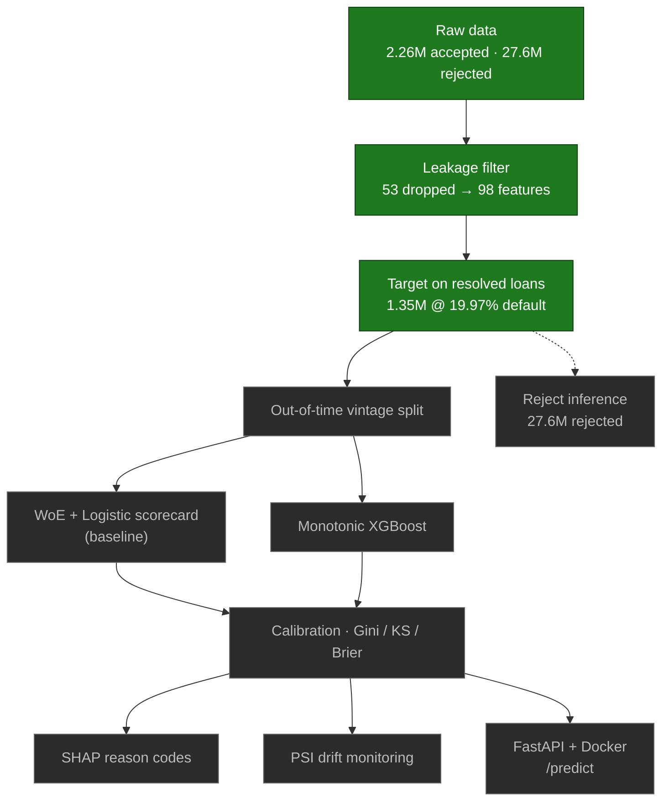

# Credit Risk PD Engine

> A probability-of-default (PD) model on **2.26 M** Lending Club loans, built with the discipline a
> bank's model-risk team would demand — not a Kaggle-style fantasy-AUC notebook.


Predict, **at the moment of application**, whether a borrower will default — with strict
data-leakage control, out-of-time validation, a regulatory-style scorecard baseline, monotonic
XGBoost, probability calibration, SHAP reason codes, PSI drift monitoring, and reject inference,
served behind a FastAPI/Docker endpoint. The data layer is implemented in **both SQL (DuckDB) and
pandas**, cross-checked to identical numbers.

> **Status: 🚧 in active development.** The data foundation (leakage control + target definition) is
> **complete and verified**; modeling onward is in progress.
> Trackers → **[PROJECT_PLAN.md](PROJECT_PLAN.md)** (checklist) ·
> **[PROJECT_JOURNAL.md](PROJECT_JOURNAL.md)** (decisions, trade-offs & challenges).

## Contents
- [Why this is different](#why-this-is-different)
- [Pipeline](#pipeline)
- [Dataset](#dataset)
- [What's built so far](#whats-built-so-far-verified)
- [Methodology](#methodology)
- [Project structure](#project-structure)
- [Setup & run](#setup--run)
- [Skills demonstrated](#skills-demonstrated)
- [Results](#results) · [Limitations](#limitations)

## Why this is different

Most public credit notebooks hit ~0.99 AUC by accidentally feeding the model the outcome — payment
history, recoveries, post-origination FICO. This project's **first** deliverable is the opposite: a
documented **leakage exclusion list** (53 banned columns) and an honest **out-of-time** evaluation.
The goal isn't a headline number; it's a model that would survive model-risk review — calibrated,
explainable, and monitored.

## Pipeline



*Green = done & verified · grey = planned.*

## Dataset

- **Source:** Lending Club accepted & rejected loans (2007–2018Q4), via Kaggle —
  [`wordsforthewise/lending-club`](https://www.kaggle.com/datasets/wordsforthewise/lending-club)
- **Accepted:** **2,260,701** rows × 151 cols (verified) — the modeling population
- **Rejected:** **27,648,741** rows × 9 cols (verified) — for reject inference
- **Why this dataset:** the standard public credit dataset with *real default outcomes*,
  loan-issue timestamps for out-of-time validation, and — rarely — a companion file of *rejected*
  applications, which is what makes a genuine reject-inference exercise possible.

> ⚠️ **Raw data is not committed** (large + licensed). Download from the Kaggle link and place the
> two `.csv.gz` files in `data/`. See [Setup](#setup--run).

## What's built so far (verified)

| Step | Result |
|---|---|
| Accepted / rejected rows | 2,260,701 / 27,648,741 |
| Leakage-safe features | **98** of 151 (53 excluded) |
| Target | `Charged Off`/`Default` = 1, `Fully Paid` = 0; in-progress & off-policy excluded |
| Modeling cohort | **1,345,350** resolved loans |
| Default rate | **19.97%** |

Implemented twice and cross-checked to identical numbers:
- **pandas** → [notebooks/01_data_understanding.ipynb](notebooks/01_data_understanding.ipynb)
- **SQL / DuckDB** → [notebooks/01_data_understanding_sql.ipynb](notebooks/01_data_understanding_sql.ipynb)
  + [sql/01_data_understanding.sql](sql/01_data_understanding.sql) (builds `data/credit.duckdb`
  with `accepted_features` & `model_data` views)

The leakage decision is fully documented in
**[reports/leakage_exclusion_list.md](reports/leakage_exclusion_list.md)**.

## Methodology

| Stage | Approach |
|---|---|
| Target | `Charged Off`/`Default` = bad, `Fully Paid` = good; immature/in-progress excluded |
| Validation | **Out-of-time vintage split** — train on older vintages, test on newer (never random) |
| Baseline | **WoE + logistic-regression scorecard** (regulatory-standard benchmark) |
| Main model | **Monotonic XGBoost** — monotonic constraints encode business logic |
| Metrics | **Gini / KS / Brier**, reported in-time vs out-of-time |
| Calibration | Reliability curves + isotonic / Platt scaling |
| Explainability | **SHAP** global importance + per-applicant reason codes |
| Reject inference | Inferred performance for rejected applicants (known-imperfect; bias discussed) |
| Monitoring | **PSI** drift on features and scores |
| Serving | **FastAPI** `/predict` endpoint, **Docker** container |

## Project structure

```
.
├── data/         # raw CSVs + credit.duckdb (gitignored — download from Kaggle)
├── notebooks/    # 01_data_understanding.ipynb (pandas) + _sql.ipynb (DuckDB)
├── sql/          # standalone SQL — 01_data_understanding.sql
├── src/          # reusable modules (features, model, scoring, API) — coming
├── models/       # saved artifacts (gitignored)
├── reports/      # leakage_exclusion_list.md, allowed_features.txt, metrics, plots
├── requirements.txt
├── PROJECT_PLAN.md      # forward checklist
└── PROJECT_JOURNAL.md   # decisions, trade-offs & challenges
```

## Setup & run

```powershell
# 1. clone
git clone https://github.com/itsprashant1999/Credit-Risk-Modelling-using-python.git
cd Credit-Risk-Modelling-using-python

# 2. environment
python -m venv .venv
.\.venv\Scripts\Activate.ps1          # Windows PowerShell
pip install -r requirements.txt

# 3. data — download from Kaggle, place the two .csv.gz files in data/
#    https://www.kaggle.com/datasets/wordsforthewise/lending-club
```

> **Notebooks:** open in VS Code / Cursor and select the **`.venv`** kernel. The SQL notebook
> auto-builds `data/credit.duckdb` from the CSVs on first run.

## Skills demonstrated

**So far:** data-leakage control & documentation · out-of-time validation design · honest target
definition · large-data handling on 16 GB (chunked / columnar) · **dual SQL (DuckDB) + pandas**
pipelines, cross-checked · reproducible ML project setup.

**In the pipeline:** WoE scorecards · gradient boosting with monotonic constraints · probability
calibration · SHAP explainability · PSI drift monitoring · reject inference · FastAPI + Docker
serving.

## Results

_Filled in as modeling phases complete._

| Model | Split | Gini | KS | Brier |
|---|---|---|---|---|
| Scorecard (WoE + LR) | in-time | _tbd_ | _tbd_ | _tbd_ |
| Scorecard (WoE + LR) | OOT | _tbd_ | _tbd_ | _tbd_ |
| Monotonic XGBoost | in-time | _tbd_ | _tbd_ | _tbd_ |
| Monotonic XGBoost | OOT | _tbd_ | _tbd_ | _tbd_ |

## Limitations

Honest limitations (incl. the reject-inference caveat and the 2007–2018 data vintage) are tracked
in **[PROJECT_JOURNAL.md](PROJECT_JOURNAL.md#known-limitations--what-id-do-differently)**; a model
card lands with the modeling phases.

## License

Educational / portfolio use. Lending Club data is subject to its own terms.
